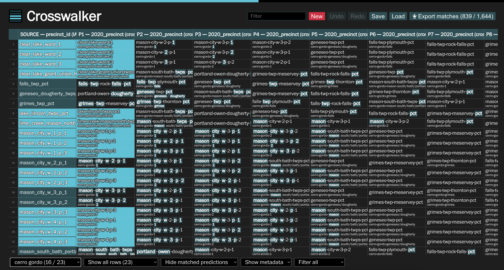
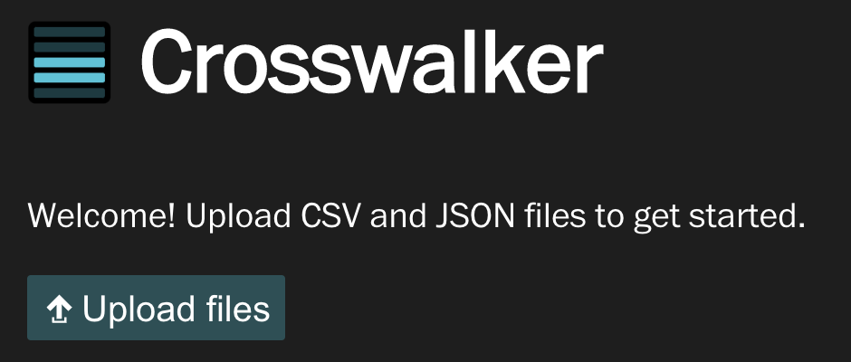
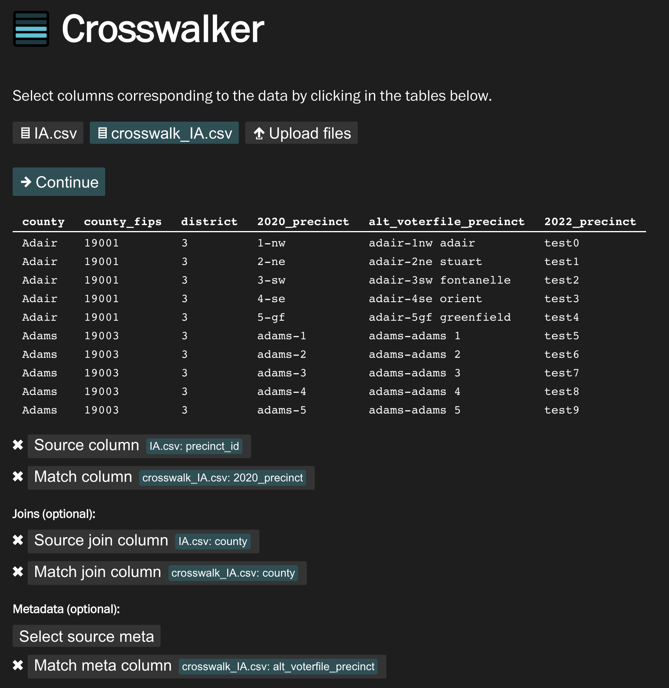
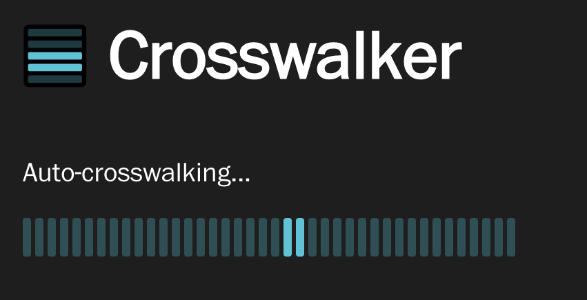

# Crosswalker

Crosswalker is a general purpose tool for joining columns of text data that don't perfectly match. How it works:

- Upload a file or two and configure how to join columns (and optional additional metadata to show)
- The tool auto-ranks matches for each data row with a specially designed fast and thorough algorithm
- The tool auto-matches values that are practically identical
- The results are presented in an interactive spreadsheet from which you can manually continue matching
- As you go, the columns are resorted to highlight the most probable remaining matches

The application is entirely local, saving nothing to the cloud. Browser-based local storage is used to auto-save your progress (as long as you're not in incognito mode), and you can save/load your progress to/from files at any point. Once you're done matching, you can download the results as a CSV file.

## Documentation

### Uploading files

When you launch Crosswalker, you get a simple welcome message along with an interface to upload CSV and JSON files. The files supported by Crosswalker are:

- CSV files with a single header row and then data rows
- JSON files that contains arrays of objects with keys and values, where the keys correspond to headers and the values correspond to data rows, e.g. `[{"key1": "A", "key2": "b"}, {"key1": "B", "key2": "a"}]`.

After uploading files, it is time to select the column configuration.

### Configuring columns

After uploading files, you are presented with a preview of the uploaded tables, along with an interface to select columns. To select a column, click on the button corresponding with the column you want to select, then hover over the table and the columns should highlight. Click on a column to select it.

Here's how the columns work:

- **Source column:** [required] The primary text that will be matched against. This will always be the leftmost column in the spreadsheet. In the case of precinct matching, this would be one of the precinct name columns.
- **Match column:** [required] The text column to match with the source column. This column will be used to populate the remaining columns of the spreadsheet (with more likely matches ranked to the left). In precinct matching, this is the other precinct name column.
- **Join columns:** [optional] Join columns are used to segment data that must be in the same bin to match. With precinct matching, a precinct in one county cannot possibly match a precinct in another, so we specify counties as join columns. Join columns are optional; if not specified, all the data will be matched together.

  The values in join columns must exactly match between the source and match columns (case-insensitive) to work, e.g. "Pennsylvania" and "PENNSYLVANIA" is ok, but "Pennsylvania" and "PA" would not do what's expected.

- **Metadata columns:** [optional] Sometimes it's useful to show additional contextual information along with the source and match text. Source and match can both have optional metadata columns which are not used in matching but are shown in a smaller font below in the table if specified.

Once the columns have been appropriately selected, you can continue to the auto-matching step.

### Auto-crosswalking

Once the configuration is in place, the application goes through all the source column data row by row and ranks each possible match text to the source. These ranked "predictions" are sorted from most probable match to least probable match. Predictions that are practically identical are automatically marked as matches.

Brief summary of how the ranking algorithm works:

- a given source and match text are to be scored
- both texts are broken into case-insensitive alphanumeric parts (e.g. `"36-Hope Church"` becomes `["36", "hope", "church"]`)
- parts that exactly match between the two texts are removed (numeric texts are compared after parsing the number, so `03` and `3` are seen as identical)
- the [minimum edit distance](https://en.wikipedia.org/wiki/Edit_distance) between permutations of the parts is calculated, and the minimum score is selected
- the final score returned is the minimum edit distance minus two times the number of characters that perfectly matched (lower is better)

For the auto-matching step, two texts are considered identical if all their parts are equal, in order, case-insensitive, e.g. `"36-Hope Church"` and `"36 hope_CHURCH"` are seen as the same.

### Interactive spreadsheet

The main part of the application consists of an interactive spreadsheet that can be used to view and edit matches, which are highlighted in bright cyan. The prediction columns show the match texts sorted from most probable to least. As you identify matches, the matched texts are sorted to the front of the matched row and removed from other rows' predictions, which makes the task easier as you go.

Commands:

- <kbd>Enter</kbd>: Mark the currently selected prediction cell(s) to be the match for the source cell in the same row (and advances the row). Pressing <kbd>Enter</kbd> on a cell that is already shown as a match toggles it to be unmatched.
- <kbd>Backspace</kbd>: Clear a match on the currently selected prediction cell(s).
- <kbd>Ctrl/Cmd + Z</kbd>: Undo (only works when the table is focused)
- <kbd>Ctrl/Cmd + Shift + Z</kbd>: Redo (only works when the table is focused)
- <kbd>← → ↑ ↓</kbd>: Moves the selection around

There are various filters and controls above and below the spreadsheet.

- **Filter query:** A search box that filters rows, columns, or both in the currently displayed spreadsheet. The default behavior is to filter both rows and columns at the same time, but this is configurable via the **Filter type** control
- **New:** This destructive button will reset the entire application to process new files. The button requires a confirmation prompt to ensure you don't accidentally press it.
- **Undo:** Undo changes
- **Redo:** Redo changes
- **Save:** Save the current application state to a file in a special format that only works with this tool. This can be used to pass work off to a colleague or back-up the current spreadsheet to work on a new set of files
- **Load:** Load an application state from a file
- **Export matches:** Export the matches into a readable CSV file that is useful for downstream analysis. Note: unlike **Save**, this file cannot be loaded back in.
- **Join filter:** Select which segment of data to display results for (only valid if you specify joins). In the screenshot above, this is the control that says "cerro gordo" (it will display the name of the currently selected join value).
- **Row filter:** Toggle between displaying all the rows (default), or only displaying complete/incomplete rows (where complete means a row that's been matched)
- **Column filter:** Toggle between hiding matched predictions (default), or showing all the matched prediction values. The default behavior is to hide predictions that have been matched in other rows, to declutter the interface. If you select to show predictions, predictions that have been matched in other rows will be colored red to show they have been used.
- **Metadata display:** Toggle between showing metadata values (default) and hiding them. This can be useful for decluttering the interface.
- **Filter type:** Controls the behavior of the search **filter query**. By default, the search query filters both rows and columns simultaneously. This can be used to only search over rows ("Filter source") or over columns ("Filter prediction").

## History

Crosswalker was originally developed as "Precinct Matcher," a tool with the express use case of matching precinct names for elections at The Washington Post (precinct names change each election cycle, and it's hard to build election models matching historical data when the names slightly change). This first iteration of the tool was designed hastily but still proved to be very useful for teammembers who used to employ a very manual code-based approach.

In this redesign of the tool, Crosswalker was made to be more generally useful by abstracting the details away from precincts and broadening the tool's scope to be broadly for text-based crosswalking problems. Counties became "join" columns, additional info to show like GeoJSON IDs became "metadata." The original tool only presented a single possible match for each precinct, using a brittle text matching algorithm. The redesigned tool presents every possible match in an interactive, performant spreadsheet as ranked by a new fast and thorough algorithm.

## Developing

This project was bootstrapped with [Create React App](https://github.com/facebook/create-react-app).

In the project directory, you can run:

### `npm start`

Runs the app in the development mode.\
Open [http://localhost:3000](http://localhost:3000) to view it in the browser.

The page will reload if you make edits.\
You will also see any lint errors in the console.

### `npm run build`

Builds the app for production to the `build` folder.
